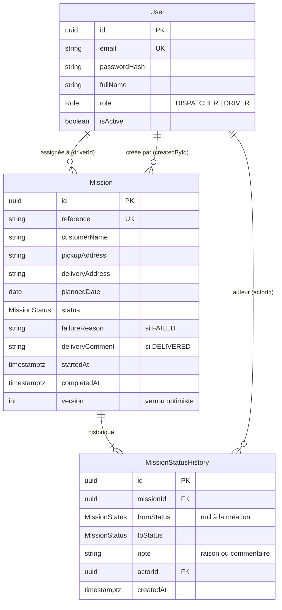

# Delivery Missions — API

Épreuve pratique CAMTRACK — **Thème 3 : gestion des missions de livraison**.

Les dispatchers créent des missions et les assignent à des chauffeurs ; chaque chauffeur
suit **ses** missions du jour et met à jour leur statut pendant sa tournée.

Ce dépôt contient **l'API** (serveur). L'interface est dans un dépôt séparé :
[delivery-missions-web](https://github.com/arnoldtonfack/delivery-missions-web).

---

## Démo en ligne

Déjà déployée, sans rien installer (comptes ci-dessous, [Comptes de test](#comptes-de-test)) :

| URL | Contenu |
| --- | --- |
| http://livraison.69-251-219-67.sslip.io:5000 | **Console web** (dispatcher et chauffeur) |
| http://69.251.219.67:4000/docs | **Swagger** de l'API |

> Secours si le nom ne résout pas : http://69.251.219.67:5000.
> Les missions de démonstration sont regénérées **chaque nuit** (00:10, heure de Douala) :
> la journée en cours a toujours des missions dans les 4 statuts. Les actions faites la
> veille sur ces missions sont remises à zéro.

---

## Installation (jury)

Prérequis : **Docker** (avec Compose) et `make`. Rien d'autre à installer sur la machine.

```bash
git clone https://github.com/arnoldtonfack/delivery-missions.git
cd delivery-missions
cp .env.example .env
make up            # build de l'image, PostgreSQL, Redis, migrations, puis l'API
make seed-docker   # comptes de test + missions de démonstration
```

| URL | Rôle |
| --- | --- |
| http://localhost:3000/docs | **Swagger** : tous les endpoints, testables (bouton *Authorize*) |
| http://localhost:3000/api/v1.0.0/… | Routes REST |
| http://localhost:3000/health | Santé (base + Redis) |

Sans `make` : `docker compose up -d --build`, puis
`docker compose run --rm app node dist/scripts/seed`.

> Ports publiés par défaut : API 3000, PostgreSQL 5440, Redis 6390 (modifiables dans `.env`).
> Relancer le seed remet les données de démonstration à zéro, sans doublon.

### Comptes de test

Mot de passe commun : **`Demo1234!`**

| Rôle | E-mail | Données du jour |
| --- | --- | --- |
| DISPATCHER | `dispatcher@livraison.test` | voit et gère tout |
| DRIVER | `chauffeur1@livraison.test` | 5 missions aujourd'hui, une par statut (dont 2 PLANNED à démarrer) |
| DRIVER | `chauffeur2@livraison.test` | 2 missions aujourd'hui |

Le seed crée aussi des missions datées du **jour précédent** et du **jour suivant** (pour
tester le filtre `date`), avec leur historique complet.

### Développement (hors Docker)

Prérequis : Node 22, pnpm (`corepack enable`), Docker pour l'infra.

```bash
cp .env.example .env
pnpm install
make infra                # PostgreSQL + Redis seulement
pnpm prisma:migrate:prod  # applique les migrations
pnpm seed
pnpm dev                  # http://localhost:3000
```

---

## Choix et justification

### Type d'application

- **API REST** (ce dépôt) + **une application web** (dépôt `delivery-missions-web`, Next.js)
  avec deux espaces selon le rôle : console desktop pour le dispatcher, écrans
  **mobile-first** pour le chauffeur, qui utilise l'application sur le terrain depuis son
  téléphone. Une application web évite l'installation d'une application native et suffit
  au besoin (pas de fonctionnalité matérielle obligatoire).
- Toutes les règles métier sont **côté serveur** : le front ne fait qu'afficher et envoyer
  des actions. Un client modifié ne peut contourner ni la machine à états ni le contrôle
  d'accès.

### Stack

| Techno | Raison |
| --- | --- |
| **NestJS 11** (TypeScript strict) | Modules, injection de dépendances, guards et pipes : contrôle d'accès et validation déclaratifs, code testable. |
| **PostgreSQL 17** | Relationnel : transactions, clés étrangères, contraintes `CHECK` et index. Le workflow est protégé jusque dans la base. |
| **Prisma 7** | Schéma unique, migrations versionnées, client typé. |
| **class-validator** | Validation des entrées sur chaque endpoint (`whitelist` + `forbidNonWhitelisted` : tout champ inconnu est refusé). |
| **JWT + bcrypt** | Authentification sans état ; mots de passe hachés (`bcryptjs`, 10 tours). |
| **Docker Compose** | Installation en une commande, identique pour le jury et en production. |
| **Redis** | Présent (santé, prêt pour une file BullMQ) mais **aucune donnée métier** : rien d'obligatoire n'en dépend. |

### Architecture

```
src/
├── main.ts                 # helmet, CORS, ValidationPipe global, préfixe /api/v1.0.0, Swagger
├── app.module.ts           # guards globaux : throttling → JWT → rôles
├── common/                 # transverse : guards, décorateurs, filtre d'erreurs, dates métier…
├── database/               # PrismaService + migrations SQL
└── modules/
    ├── auth/               # login, profil courant
    ├── drivers/            # gestion des chauffeurs (DISPATCHER)
    ├── missions/           # missions, machine à états, historique
    │   ├── mission-status.machine.ts   # SEULE table des transitions autorisées
    │   └── mission-access.ts           # portée : un chauffeur ne voit que ses missions
    └── dashboard/          # compteurs par statut du jour
```

- Contrôleurs : routage uniquement. Services : logique métier + requêtes Prisma.
- Réponse de succès : `{ "success": true, "data": …, "timestamp": … }`.
- Erreur : `{ "statusCode": 409, "message": "INVALID_STATUS_TRANSITION", "error": "Conflict" }`.
  `message` est un **code métier** stable, que le front traduit en message clair.

### Modèle de données



- **Un chauffeur est un utilisateur** de rôle `DRIVER` : un seul modèle de compte, un seul
  login. Il n'est **jamais supprimé**, seulement désactivé, pour garder l'historique.
- **Historique en table séparée**, en ajout seul : chaque changement de statut garde qui,
  quand, de → vers et la note.
- **Contraintes `CHECK`** écrites à la main dans la migration initiale :
  - raison non vide si `FAILED` ;
  - `startedAt` présent dès que la mission n'est plus `PLANNED` ;
  - `completedAt` présent si et seulement si la mission est terminée ;
  - `version >= 0`.
- **Index** sur les filtres fréquents : `(driverId, plannedDate, status)`,
  `(plannedDate, status)`, `(missionId, createdAt)`.
- Schéma : [`prisma/schema.prisma`](prisma/schema.prisma) ; migrations :
  [`src/database/migrations/`](src/database/migrations/).

---

## Règles métier (hypothèses retenues)

- **Workflow** : `PLANNED → STARTED → DELIVERED | FAILED`. La table des transitions
  autorisées est côté serveur ; toute autre transition donne `409 INVALID_STATUS_TRANSITION`.
  `DELIVERED` et `FAILED` sont terminaux : une nouvelle tentative = une nouvelle mission.
- **Seul le chauffeur assigné** démarre, livre ou déclare l'échec de sa mission. Un
  dispatcher reçoit 403.
- **Un chauffeur ne voit jamais la mission d'un autre** :
  - le filtre est dans la requête SQL elle-même, pas un contrôle fait après la lecture ;
  - la mission d'un autre chauffeur répond `404 MISSION_NOT_FOUND`, comme une mission
    inexistante, pour ne pas révéler qu'elle existe ;
  - tout `driverId` envoyé par un chauffeur dans les filtres est ignoré.
- **Atomicité et concurrence** :
  - statut, horodatage serveur et entrée d'historique sont écrits dans **une transaction** ;
  - l'écriture est conditionnée par `version` et le statut lus. Un double clic ou deux
    actions simultanées (ex. livrer et échouer en même temps) : une seule passe, l'autre
    reçoit `409` ;
  - ce comportement est vérifié par un test e2e de concurrence réelle.
- **Échec** : raison obligatoire, non vide après suppression des espaces.
  **Livraison** : commentaire optionnel.
  Dans les deux cas, la date et l'heure sont celles du serveur (`completedAt`) et le texte est
  repris dans l'historique.
- **« Aujourd'hui »** = date dans le fuseau **Africa/Douala**, calculée par le serveur
  (jamais l'horloge du téléphone). Sans filtre `date`, la liste et le dashboard portent sur
  les missions **prévues** aujourd'hui.
- **Création / modification** :
  - date prévue aujourd'hui ou plus tard ;
  - le chauffeur assigné doit être un `DRIVER` **actif** ;
  - la référence est normalisée (majuscules) et unique ;
  - une mission n'est modifiable ou réassignable **que tant qu'elle est `PLANNED`**.
- **Désactivation d'un chauffeur** refusée s'il a encore des missions `PLANNED` ou `STARTED`.
  Un verrou sur la ligne du chauffeur l'empêche de se faire en même temps qu'une assignation.

---

## Endpoints

Préfixe : `/api/v1.0.0`. Tous exigent un jeton `Authorization: Bearer …` sauf le login.
Détail des corps, réponses et erreurs dans **Swagger** (`/docs`).

| Méthode | Route | Rôle | Effet |
| --- | --- | --- | --- |
| POST | `/auth/login` | public | Connexion e-mail + mot de passe → jeton JWT (limité à 10/min) |
| GET | `/auth/me` | tous | Utilisateur connecté |
| POST | `/drivers` | DISPATCHER | Créer un chauffeur |
| GET | `/drivers?isActive=` | DISPATCHER | Lister les chauffeurs |
| GET | `/drivers/:id` | DISPATCHER | Détail d'un chauffeur |
| PATCH | `/drivers/:id` | DISPATCHER | Modifier un chauffeur |
| PATCH | `/drivers/:id/status` | DISPATCHER | Activer / désactiver un chauffeur |
| POST | `/missions` | DISPATCHER | Créer et assigner une mission |
| GET | `/missions?date=&driverId=&status=` | tous | Missions d'un jour (aujourd'hui par défaut) ; un chauffeur ne voit que les siennes |
| GET | `/missions/:id` | tous | Détail + historique des statuts (qui, quand) |
| PATCH | `/missions/:id` | DISPATCHER | Modifier / réassigner (si `PLANNED`) |
| POST | `/missions/:id/start` | DRIVER assigné | `PLANNED → STARTED` |
| POST | `/missions/:id/deliver` | DRIVER assigné | `STARTED → DELIVERED`, commentaire optionnel |
| POST | `/missions/:id/fail` | DRIVER assigné | `STARTED → FAILED`, raison obligatoire |
| GET | `/dashboard?date=` | tous | Nombre de missions du jour par statut (les siennes pour un chauffeur) |
| GET | `/health` | public | Santé (hors préfixe) |

---

## Tests

- **115 tests unitaires** (`pnpm test`), dépendances mockées. Ils couvrent en priorité :
  - la machine à états : les 16 couples de statuts sont vérifiés ;
  - le contrôle d'accès et les transitions ;
  - l'authentification, les guards, les chauffeurs et le dashboard.
- **74 tests e2e** (`pnpm test:e2e`, contre la vraie base : `make infra` avant) :
  parcours HTTP complets, avec notamment :
  - l'isolation entre chauffeurs ;
  - le double clic ;
  - des transitions **réellement concurrentes** ;
  - la validation des entrées.

```bash
pnpm lint && pnpm typecheck && pnpm test && pnpm test:e2e
```

---

## Fait / pas fait

**Fait — les 6 fonctionnalités obligatoires côté API :**

1. Gestion des chauffeurs et des missions (référence, client, adresses, date prévue,
   chauffeur, statut).
2. Workflow `PLANNED → STARTED → DELIVERED | FAILED` imposé par le serveur, raison
   obligatoire si `FAILED`.
3. Liste filtrée par date, chauffeur et statut ; détail avec historique (qui, quand).
4. Chauffeur : connexion, ses missions du jour, détail, démarrer / livrer / échouer.
5. Livraison : commentaire, date et heure enregistrées par le serveur.
6. Dashboard : nombre de missions par statut pour la journée.

Exigences communes : authentification, mots de passe hachés, 2 rôles, validation, gestion
d'erreurs, seed et tests.

**Pas fait :**

- Fonctionnalités bonus (position GPS, photo ou signature, notification d'assignation,
  mode hors ligne).
- Suppression d'une mission : elle n'est pas prévue, pour garder l'historique.
- Pagination de la liste : elle est bornée à un jour.

## Améliorations possibles

- Notification au chauffeur lors d'une assignation : file BullMQ, Redis est déjà en place.
- Preuve de livraison (photo ou signature) et position GPS enregistrées avec la transition.
- Mode hors ligne côté chauffeur : file locale d'actions rejouées à la reconnexion. Le
  verrou `version` rend ce rejeu sûr.
- Annulation d'une mission (`PLANNED → CANCELLED`) et pagination de l'historique.
- Jeton de rafraîchissement et révocation des sessions.

---

## Utilisation de l'IA

Assistants IA utilisés (Claude Code, Codex) pour la génération et la relecture du code.
Les choix de conception, les règles métier et les vérifications (tests, relecture) ont été
faits par le candidat.
